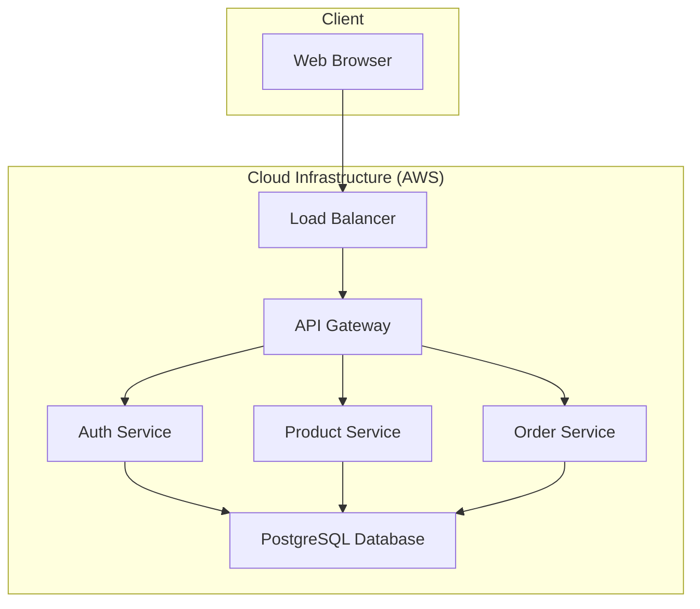

# Architectural Design Document

**Project:** [Project Name]
**Version:** 1.0
**Date:** [Date]
**Author(s):** [Your Name/Team]

---

## 1. Introduction

### 1.1. Purpose
This document provides a comprehensive architectural overview of the [Project Name] system. It describes the high-level structure, key components, their interactions, and the design principles that guide development. Its purpose is to align stakeholders and provide a technical roadmap for the development team.

### 1.2. Scope
The scope of this architecture covers the following key functional areas:
-   User authentication and authorization.
-   Core business logic for [describe main feature, e.g., "managing inventory"].
-   Data persistence and management.
-   External API integrations with [e.g., "Stripe for payments"].

The following are considered out of scope for this document:
-   Detailed UI/UX design.
-   Third-party system internal architecture.

### 1.3. Definitions, Acronyms, and Abbreviations
| Term  | Definition                               |
| :---- | :--------------------------------------- |
| API   | Application Programming Interface        |
| DB    | Database                                 |
| CI/CD | Continuous Integration/Continuous Delivery |

---

## 2. Architectural Goals and Constraints

### 2.1. Goals (Quality Attributes)
The architecture is designed to meet the following goals:
-   **Scalability:** The system must handle up to [e.g., "10,000 concurrent users"] with a response time under [e.g., "200ms"].
-   **Reliability:** The system should achieve 99.9% uptime.
-   **Maintainability:** Components should be loosely coupled to allow for independent updates and easy troubleshooting.
-   **Security:** All data in transit and at rest must be encrypted. The system must be protected against common web vulnerabilities (OWASP Top 10).

### 2.2. Constraints
-   **Technology Stack:** The backend must be built using [e.g., "Node.js and PostgreSQL"]. The frontend will be [e.g., "React"].
-   **Infrastructure:** The application will be deployed on [e.g., "Amazon Web Services (AWS)"].
-   **Budget/Timeline:** The initial version must be delivered by [Date], which influences the complexity of the chosen patterns.

---

## 3. System Overview

### 3.1. High-Level Architecture
The system follows a [e.g., "Microservices", "Monolithic", "Serverless"] architecture.

*(Insert a high-level diagram here. You can use tools like diagrams.net (draw.io), Mermaid, or PlantUML to create one.)*

**Example using Mermaid syntax:**

### 3.2. Component Breakdown

#### 3.2.1. API Gateway
**Description:** The single entry point for all client requests. It handles routing, rate limiting, and authentication.
**Technology:** [e.g., "Amazon API Gateway", "NGINX"]

#### 3.2.2. Authentication Service
**Description:** Manages user registration, login, and session management (e.g., JWT generation).
**Technology:** [e.g., "Node.js (Express)", "Passport.js"]

#### 3.2.3. [Service/Module Name]
**Description:** [Describe the responsibilities of this component].
**Technology:** [e.g., "Python (Flask)"]
**Dependencies:** [e.g., "Database, Redis Cache"]

---

## 4. Data Management

### 4.1. Database Schema
The system uses a [e.g., "PostgreSQL relational database"].

*(Insert an Entity-Relationship Diagram (ERD) here.)*

**Key Tables:**
-   `users`: Stores user profile information and credentials.
-   `products`: Contains product details and inventory levels.
-   `orders`: Records customer orders and their status.

### 4.2. Data Flow
User-generated data flows from the client through the API Gateway to the relevant service, which then validates and persists it in the database. All sensitive data is encrypted before being stored.

---

## 5. Deployment and Operations

### 5.1. Infrastructure
The application is hosted on AWS. Key services include:
-   **Compute:** [e.g., "EC2, Lambda, EKS"]
-   **Database:** [e.g., "RDS for PostgreSQL"]
-   **Networking:** [e.g., "VPC, Route 53, ELB"]

### 5.2. CI/CD
The CI/CD pipeline is managed by [e.g., "GitHub Actions"]. The process is as follows:
1.  Developer pushes code to a feature branch.
2.  A pull request triggers automated tests and linting.
3.  On merge to `main`, the code is automatically built, containerized, and deployed to a staging environment.
4.  Manual approval is required for promotion to the production environment.

---

## 6. Architectural Decisions
This section logs key architectural decisions and their rationale.

| Decision ID | Decision                                                              | Rationale                                                              |
| :---------- | :-------------------------------------------------------------------- | :--------------------------------------------------------------------- |
| ADR-001     | Chose Microservices over a Monolith.                                  | Allows for independent scaling and deployment of services.             |
| ADR-002     | Use PostgreSQL as the primary database.                               | Strong support for relational data, transactions, and proven reliability.|
| ADR-003     | Use JWT for stateless authentication.                                 | Avoids server-side session storage, simplifying scalability.          |